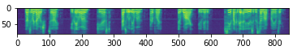
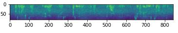

# Sound Cleaner
<br>
Модуль для определения зашумленности в звуковом файле по mel-спектрограмме, а также очистки спектрограммы от шумов.<br>

Модели для обнаружения и подавления шума в спектрограмме обучались на выборке mel-спектрограмм с чистыми и зашумленными звуковыми файлами с голосом человека. Чистым звуком считается звук голоса без посторонних шумов (возможно с паузами).<br>



Шумом на зашумленных аудиозаписях может являться любой посторонний звук, который можно услышать в повседневной жизни: звонок телефона, проезжающая машина, звуки от чайника, смех и т.д.<br>



Модели реализованы на фремворке TensorFlow 2.6.0 <br>


## Структура
<br>

```
└───src        
    └───ipynb
    |    test_model.ipynb        ноутбук для демонстрации работы моделей
    │    train_classifier.ipynb  ноутбук для обучения модели классификации mel-спектрограмм (чистая/зашумленная)
    │    train_dae.ipynb         ноутбук для обучения модели шумоподавления в mel-спектрограмме
    └───py
    |    noise_catcher.py        скрипт с интерфейсом для работы с моделью классификации mel-спектрограмм (чистая/зашумленная)
    |    sound_cleaner.py        скрипт с интерфейсом для работы с моделью шумоподавления
└───weights                      веса моделей
```
<br><br>

## Примеры запуска
<br>
Запустить классификацию mel-спектрограмм для определения является ли она чистой или зашумленной можно несколькими способами<br>

Подключить в скрипт или ноутбук скрипт noise_catcher.py и вызвать метод класса NoiseCatcher **is_noisy**, передав туда путь к файлу с спектрограммой:

<pre><code>
from noise_catcher import NoiseCatcher
...

clean_spec = os.path.join(ROOT_DIR, 'spec_file_path.npy')

nc = NoiseCatcher()
nc.is_noisy(clean_spec)
</code></pre>


Запустить скрипт **noise_catcher.py** из консоли :

<pre><code>
python noise_catcher.py --spec spec_file_path.npy
</code></pre>

Запустить шумоподавление можно аналогично классификации:

<pre><code>
from sound_cleaner import SoundCleaner
...

noisy_spec = os.path.join(ROOT_DIR, 'spec_file_path.npy')

sc = SoundCleaner()
spec = sc.denoise(noisy_spec, os.path.join(ROOT_DIR, 'save_path_to_clean.npy'))
</code></pre>

Запустить скрипт **sound_cleaner.py** из консоли :

<pre><code>
python sound_cleaner.py --spec /noisy_spec_path.npy --save /clean_result_spec_path.npy
</code></pre>

[пример](https://github.com/keymkm/SoundCleaner/blob/master/src/ipynb/test_model.ipynb)
